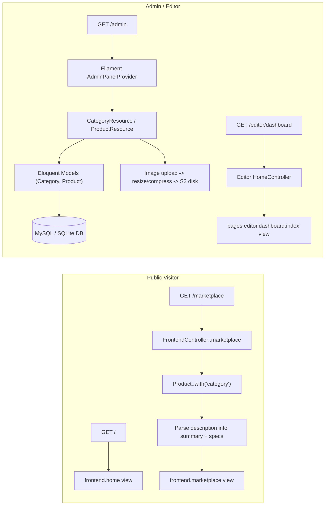
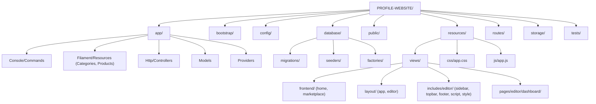

# PROFILE-WEBSITE (IGB — Inter G Queen Bumindo)

Company profile & mini-marketplace website for **IGB (Inter G Queen Bumindo)**, built on Laravel 13 with a Filament 5 admin panel.

> The page `<title>` tag found in `resources/views/layout/app.blade.php` reads: *"IGB — Inter G Queen Bumindo | Accelerating Innovation & Technology"*. This is the only place a formal project/company name appears in the codebase; there is no separate "About the project" document.

## Table of Contents

- [Short Description](#short-description)
- [Project Overview](#project-overview)
- [Technology Stack](#technology-stack)
- [Project Structure](#project-structure)
- [Code Convention](#code-convention)
- [Development Rules](#development-rules)
- [Installation](#installation)
- [Environment Variables](#environment-variables)
- [Scripts](#scripts)
- [Features](#features)
- [API](#api)
- [Database](#database)
- [State Management](#state-management)
- [Internationalization](#internationalization)
- [Theming](#theming)
- [Security](#security)
- [Deployment](#deployment)
- [Future Improvements](#future-improvements)
- [Contributing](#contributing)
- [License](#license)

---

## Short Description

### What this project is

A server-rendered **Laravel 13** web application that combines:

1. A **public marketing/company-profile front end** (hero, about, services, contact sections, plus a product marketplace page) served through Blade views.
2. A **Filament 5 admin panel** (mounted at `/admin`) for managing `Category` and `Product` records, with image uploads to S3-compatible storage.
3. A **secondary "editor" area** (`/editor/dashboard`) that currently renders a static dashboard page.

### What problem it solves

It gives a company (IGB / Inter G Queen Bumindo, an "IT Solution Provider" per the hero copy in `home.blade.php`) a single Laravel codebase to:
- Present its services and company profile to visitors.
- List and sell/showcase IT-related products (laptops, storage, software licenses, accessories) in a "marketplace" catalog page.
- Let staff manage that product catalog through a dedicated admin panel without needing direct database access.

### Main objectives (inferred from the code)

- Serve a single-page-style company profile (hero, about, services, contact) at `/`.
- Provide a browsable product catalog at `/marketplace`, backed by a real `products` table.
- Give non-developers a CRUD interface (Filament) to manage `categories` and `products`.
- Store product images externally on S3-compatible object storage rather than the local disk.

### Target users

- **Site visitors / potential clients** — browse the company profile and marketplace.
- **Internal admin/staff (`role = admin`)** — manage products and categories via the Filament panel at `/admin`.
- **Regular authenticated users (`role = user`)** — the `users` table supports a `role` column, but no user-facing authenticated feature beyond the Filament gate (`canAccessPanel`) was found for this role.

### Key features

- Company profile landing page with hero, about, services, and contact sections (`resources/views/frontend/home.blade.php`).
- Product marketplace listing page that parses free-text product descriptions into a summary + key/value spec table (`FrontendController::marketplace`).
- Filament admin resources for **Products** and **Categories** (list/create/edit, image upload, status badges).
- Custom image-compression logic on upload (resizing + JPEG re-encoding before storing to S3).
- An Artisan console command (`products:compress-images`) to retroactively compress locally stored product images.
- A minimal "editor" dashboard route, currently a static placeholder view.

---

## Project Overview

### What this application does

The app is a single Laravel monolith that renders HTML via Blade templates (no separate JS SPA framework — Vite is used only to bundle CSS/JS assets, not a JS framework). It exposes:

- Public marketing routes (`/`, `/about`, `/services`, `/contact`, `/marketplace`).
- An `/editor/dashboard` route (and a duplicate `/Editor/dashboard`) showing a static admin-style dashboard.
- A Filament-powered admin panel at `/admin` for managing catalog data.
- A temporary debug route `/debug-s3` that inspects the S3 filesystem configuration (explicitly commented in the code as `//debug sementara - HAPUS setelah selesai`, i.e. "temporary debug – DELETE when done").

### How users interact with it

1. A visitor loads `/` and sees the company profile (hero, about, services, contact — these are anchored `<section>` blocks inside one Blade view, not separate pages).
2. A visitor can navigate to `/marketplace` to see a grid/list of products pulled live from the `products` table, each enriched with a parsed description (summary + spec list) and category label.
3. An admin logs into `/admin` (Filament's built-in login) and manages `Category` and `Product` records through generated CRUD screens.
4. When an admin uploads a product image in Filament, a custom `saveUploadedFileUsing` callback resizes the image (max width 800px) and re-encodes it as a JPEG (quality 70) before storing it on the `s3` disk under `products/`.

### Main workflows



### Business logic

- **Product description parsing**: `FrontendController::marketplace()` splits each `Product::description` on a blank line into a "summary" paragraph and a block of `Key: Value` spec lines, which it turns into an associative `specs` array for display. This logic depends on seed/admin-entered descriptions following that `summary\n\nKey: Value` convention (see `ProductsSeeder`).
- **Status inference**: The seeder infers a numeric `stock` value from the product's `status` (`digital` → 99, `baru` → 10, `bekas` → 1) — this is seed-only logic, not enforced by the model or a form rule.
- **Image compression on upload**: Implemented directly inside `ProductForm`'s `FileUpload::saveUploadedFileUsing` closure using PHP's GD extension (resize + JPEG re-encode), rather than in a dedicated service class.
- **Panel access control**: `User::canAccessPanel()` only allows the Filament admin panel for users whose `role` column equals `'admin'`.

### Architecture overview

This is a **standard Laravel MVC application** using Laravel's default directory layout (not a custom Clean/Hexagonal/DDD structure), with the **Filament package** layered on top for the admin CRUD interface. See [Project Structure](#project-structure) for the detailed architecture classification.

---

## Technology Stack

### Languages

- **PHP 8.3** (backend, required per `composer.json`: `"php": "^8.3"`).
- **Blade** (server-rendered templating).
- **JavaScript** (minimal, for Vite entry point `resources/js/app.js`).
- **CSS** (via `resources/css/app.css`, processed with Tailwind CSS v4).
- GitHub's language stats for the repo: HTML 38.5%, Blade 23.9%, CSS 23.2%, PHP 10.0%, SCSS 2.8%, JavaScript 1.5%, Dockerfile 0.1%.

### Frameworks / Runtime

- **Laravel Framework ^13.8** — the core backend web framework.
- **Filament ^5.6** — admin panel / TALL-stack CRUD builder, used for the `/admin` panel.
- **Laravel Tinker ^3.0** — interactive REPL for the app (dev dependency-adjacent, listed under `require`).

### UI / Styling

- **Tailwind CSS ^4.0** (via `@tailwindcss/vite` plugin) — utility-first CSS, used for at least part of the styling pipeline.
- Hand-written custom CSS is also present directly inside Blade files (e.g., large `<style>` blocks in `layout/app.blade.php`).
- **Laravel Vite Plugin (`laravel-vite-plugin` ^3.1)**, including its `fonts()` helper to self-host the "Instrument Sans" Bunny Fonts font.

### State Management

- Not applicable in the frontend sense — there is **no client-side JS framework** (no React/Vue/Alpine store detected in `resources/js/app.js`). State is standard Laravel server-side (Eloquent + session), plus whatever the bundled Filament/Livewire stack manages internally for its own admin UI (Livewire ships as a Filament dependency but is not directly used by custom app code beyond the `TemporaryUploadedFile` type-hint in `ProductForm.php`).

### Routing

- Laravel's native router (`routes/web.php`, `routes/console.php`), configured through `bootstrap/app.php` (`Application::configure()->withRouting(...)`).
- Filament registers its own panel routes (prefixed `/admin`) via `AdminPanelProvider`.

### Database

- **SQLite** is the default connection (`DB_CONNECTION` defaults to `sqlite` in `config/database.php`), with **MySQL** fully configured as an alternative connection.
- A MySQL dump, `website-profile.sql`, is included at the repo root (phpMyAdmin export, database name `website-profile`), suggesting MySQL is used in at least one deployment/environment.

### ORM

- **Eloquent ORM** (Laravel's built-in ORM) — `Category`, `Product`, and `User` models extend `Illuminate\Database\Eloquent\Model` / `Authenticatable`.

### Authentication

- Laravel's built-in auth scaffolding config (`config/auth.php`) plus **Filament's panel login** (`->login()` in `AdminPanelProvider`) gate access to `/admin`.
- Authorization is a simple role check: `User::canAccessPanel()` requires `role === 'admin'`.
- No separate public-facing login/registration controller or routes were found — only the Filament panel login.

### API layer

- No REST/GraphQL API layer or `routes/api.php` file was found in this repository. **Not found in the current codebase.**
- `bootstrap/app.php` does configure `shouldRenderJsonWhen` for requests matching `api/*`, meaning the app is prepared to return JSON error responses for an API namespace, but no such routes are currently defined.

### Backend services / Storage

- **S3-compatible object storage** (via `league/flysystem-aws-s3-v3`) is configured as an `s3` disk in `config/filesystems.php` and is the disk used for product image uploads (`ProductForm`, `Product::getImageUrlAttribute()`, and the `/debug-s3` route).
- **Local disk** and **public disk** are also configured (Laravel defaults).
- `laravel/pail` (dev) — real-time log tailing in the terminal.

### Realtime

- Not found in the current codebase. No broadcasting driver, WebSocket, or Pusher/Reverb configuration is used beyond Laravel's default (unused) broadcasting scaffolding.

### Build tools

- **Vite ^8.0** as the frontend bundler, orchestrated through `laravel-vite-plugin`.

### Package manager

- **Composer** for PHP dependencies (`composer.json` / `composer.lock`).
- **npm** for JavaScript dependencies — `package.json` scripts and the Dockerfile both explicitly use `npm install` / `npm run build`. No Yarn, pnpm, or Bun lockfile or scripts exist anywhere in this repository.

### Linting / Formatting

- **Laravel Pint ^1.27** (dev dependency) — PHP code style fixer. No custom `pint.json` config file was found, so it uses Pint's default preset.
- `.editorconfig` defines base formatting rules: UTF-8, LF line endings, 4-space indent (2-space for YAML), trimmed trailing whitespace, final newline.

### Testing libraries

- **PHPUnit ^12.5** (via `phpunit/phpunit` and Laravel's `test` Composer script), configured in `phpunit.xml` with `Unit` and `Feature` test suites.
- **Mockery ^1.6** — mocking library, available as a dev dependency.
- **FakerPHP ^1.23** — fake data generation, used in `UserFactory`.
- **Nunomaduro/Collision ^8.6** — improved CLI error reporting for tests/artisan.

### Deployment platform

- A **Dockerfile** (PHP 8.3-CLI based image) is included, exposing port `10000` and running `php artisan serve --host=0.0.0.0 --port=$PORT`. This strongly suggests deployment to a container platform that injects a `$PORT` environment variable (e.g., Render, Railway, or similar PaaS). No platform-specific config file (e.g., `render.yaml`, `Procfile`, `fly.toml`) was found, so the exact target platform is **not found in the current codebase** beyond what the Dockerfile implies.

### All packages from `composer.json` and `package.json`

**PHP — `require` (production):**

| Package | Why it's used |
|---|---|
| `php` `^8.3` | Minimum PHP runtime version. |
| `filament/filament` `^5.6` | Powers the `/admin` panel: resources, forms, tables, actions for `Category` and `Product`. |
| `laravel/framework` `^13.8` | Core web framework (routing, Eloquent, Blade, console, etc.). |
| `laravel/tinker` `^3.0` | REPL for interacting with the app via `php artisan tinker`. |
| `league/flysystem-aws-s3-v3` `^3.0` | S3-compatible filesystem adapter, used by the `s3` disk for product images. |

**PHP — `require-dev`:**

| Package | Why it's used |
|---|---|
| `fakerphp/faker` `^1.23` | Generates fake data in `UserFactory`. |
| `laravel/pail` `^1.2.5` | Tails Laravel logs in real time; wired into the `composer dev` script. |
| `laravel/pao` `^1.0.6` | Present in `composer.json`; no direct usage found elsewhere in the codebase — likely a Laravel tooling/scaffolding helper. |
| `laravel/pint` `^1.27` | PHP code style fixer/linter. |
| `mockery/mockery` `^1.6` | Test double/mocking library. |
| `nunomaduro/collision` `^8.6` | Pretty CLI error output for `artisan`/tests. |
| `phpunit/phpunit` `^12.5.12` | Test runner for `tests/Unit` and `tests/Feature`. |

**JavaScript — `devDependencies` (there are no runtime `dependencies` in `package.json`):**

| Package | Why it's used |
|---|---|
| `@tailwindcss/vite` `^4.0.0` | Integrates Tailwind CSS v4 directly into the Vite build pipeline. |
| `concurrently` `^9.0.1` | Runs multiple dev processes together (server, queue listener, log tail, Vite) via the Composer `dev` script. |
| `laravel-vite-plugin` `^3.1` | Connects Vite output to Laravel's Blade asset helpers (`@vite`) and self-hosts fonts. |
| `tailwindcss` `^4.0.0` | Utility-first CSS framework used for styling. |
| `vite` `^8.0.0` | Frontend build tool/dev server. |

---

## Project Structure



### `app/`
The application's PHP source root, following Laravel's default PSR-4 `App\` namespace convention.

- **`app/Http/Controllers/`** — Request handlers. Contains `Controller.php` (base abstract class), `FrontendController.php` (public site: home, marketplace, and route-declared-but-unimplemented `about`/`services`/`contact` methods — see [API](#api)), and `Editor/HomeController.php` (editor dashboard). Interacts with `Models` (Eloquent) and returns `Views`.
- **`app/Models/`** — Eloquent models: `Category`, `Product`, `User`. Also contains a stray, effectively-unused `users.php` model (lowercase filename, empty class body) — see [Code Convention](#code-convention) for the naming issue this represents.
- **`app/Filament/Resources/`** — Filament admin CRUD definitions, organized **feature-by-resource**: each of `Categories/` and `Products/` has its own `Pages/`, `Schemas/` (form definitions), and `Tables/` (table column definitions) subfolders alongside the top-level `*Resource.php` class. This is the idiomatic Filament v4/v5 resource layout.
- **`app/Providers/`** — Service providers. `AppServiceProvider.php` forces HTTPS URLs in production. `Providers/Filament/AdminPanelProvider.php` configures the entire `/admin` panel (path, colors, middleware, resource/page/widget auto-discovery).
- **`app/Console/Commands/`** — Custom Artisan commands. `CompressProductImages.php` batch-resizes/compresses locally stored product images (a maintenance/cleanup command, independent of the live upload-time compression in `ProductForm`).

### `bootstrap/`
Laravel's framework bootstrap files. `app.php` wires up routing (`web.php`, `console.php`), the `/up` health-check endpoint, global middleware (`trustProxies`), and exception rendering (`shouldRenderJsonWhen('api/*')`). `bootstrap/cache/` holds framework-generated cache files.

### `config/`
Standard Laravel configuration files (`app.php`, `auth.php`, `cache.php`, `database.php`, `filesystems.php`, `logging.php`, `mail.php`, `queue.php`, `services.php`, `session.php`) — all environment-driven via `env()` calls, none of which have been meaningfully customized beyond adding the `s3` disk usage described above.

### `database/`
- **`migrations/`** — Schema history: Laravel's default `users`/`cache`/`jobs` migrations, plus custom `categories` and `products` table migrations, and two later migrations that add a `role` column to `users` and change `products.status` from boolean to string.
- **`seeders/`** — `DatabaseSeeder.php` (creates an admin and a test user) and `ProductsSeeder.php` (seeds 4 categories and 13 realistic IT products with Indonesian-language descriptions).
- **`factories/`** — `UserFactory.php` for generating fake `User` records in tests/seeding.

### `public/`
Web server document root. Contains `index.php` (Laravel's front controller), compiled/static assets (`css/`, `js/`, `fonts/`), `robots.txt`, `favicon.ico`, and a large **`template_admin/`** directory (~24 MB) containing a third-party HTML/CSS/JS admin dashboard template — used as the static asset source for the `editor` dashboard views (see `includes/editor/*.blade.php`, which reference this template's script/style paths).

### `resources/`
- **`views/frontend/`** — Public-facing pages: `home.blade.php` (hero/about/services/contact sections) and `marketplace.blade.php` (product grid).
- **`views/layout/`** — Shared layouts: `app.blade.php` (main public site layout, very large — includes extensive inline `<style>`) and `editor.blade.php` (editor/admin-style layout).
- **`views/includes/editor/`** — Partial Blade includes for the editor layout: `sidebar`, `topbar`, `footer`, `script`, `style`.
- **`views/pages/editor/dashboard/`** — The single `index.blade.php` rendered by `Editor\HomeController`.
- **`views/welcome.blade.php`** — Laravel's default starter welcome page (still present in the repo; not referenced by any route in `routes/web.php`).
- **`css/app.css`** and **`js/app.js`** — Vite entry points referenced by `vite.config.js`.

### `routes/`
- **`web.php`** — All HTTP routes (public frontend, editor prefix, and a temporary debug route). No `api.php` file exists.
- **`console.php`** — Artisan console route/command definitions (only the default `inspire` command).

### `storage/`
Laravel's default writable storage tree: `app/` (private/public file storage — where `CompressProductImages` reads from locally), `framework/` (cache, sessions, views cache), `logs/`.

### `tests/`
- **`Feature/`** — `ExampleTest.php` (Laravel's default homepage test) and `EditorDashboardRouteTest.php` (asserts both `/editor/dashboard` and `/Editor/dashboard` return HTTP 200).
- **`Unit/`** — `ExampleTest.php` (Laravel's default unit test stub).
- **`TestCase.php`** — Base test case.

### Root-level files
`artisan` (Artisan CLI entry point), `composer.json`/`composer.lock` (PHP deps), `package.json` (JS deps), `vite.config.js` (build config), `phpunit.xml` (test config), `Dockerfile` (container build), `website-profile.sql` (MySQL export of the schema/data), `.editorconfig`, `.gitattributes`, `.gitignore`, `.npmrc`, `.dockerignore`.

### Architecture classification

**This project follows Laravel's default Layered (MVC) architecture, with a feature-based sub-structure inside `app/Filament/Resources/`.**

Reasoning:
- It uses Laravel's stock top-level layering: `Controllers` → `Models` → `Views`, with no custom domain/service/repository layer, no `app/Domain`, `app/Services`, or `app/UseCases` directories.
- It is **not** Clean Architecture or DDD — there are no interface/port abstractions, no dependency-inversion boundaries between "business rules" and "framework," and business logic (e.g., description parsing) lives directly inside a controller method.
- The **Filament admin module** is organized in a **feature-based** way (one folder per resource — `Categories/`, `Products/` — each self-contained with its own Pages/Schemas/Tables), which is idiomatic for Filament but is a localized pattern, not the whole app's architecture.
- Overall, this is best described as a **Hybrid**: classic Laravel layered MVC for the main app, with a feature-based module pattern specifically for the Filament admin resources.

---

## Code Convention

> Conventions below are **observed from the actual code**, not assumed. Where the codebase is inconsistent, that inconsistency is called out explicitly.

- **Folder naming**: PascalCase for PHP namespaced folders (`Http/Controllers`, `Filament/Resources`), matching PSR-4 autoloading in `composer.json`. Lowercase for framework/tooling folders (`config`, `routes`, `database`, `public`, `resources`).
- **File naming**: PHP classes are named in `StudlyCase.php` matching their class name (`FrontendController.php`, `CategoryResource.php`), consistent with PSR-4. **Exception found**: `app/Models/users.php` defines `class users extends Model {}` with a lowercase class and file name — this breaks the StudlyCase convention used everywhere else and duplicates the purpose of the proper `User.php` model. It appears to be leftover/dead code.
- **Component naming (Filament)**: Each Filament resource is split into `{Resource}Resource.php`, `Schemas/{Resource}Form.php`, and `Tables/{Resource}Table.php` — a consistent, repeatable naming pattern across `Categories` and `Products`.
- **Function/method naming**: `camelCase` for methods (`getImageUrlAttribute`, `inferBrand`, `inferStock`), following Laravel/PSR conventions. Eloquent accessor naming follows Laravel's `get{Attribute}Attribute` magic-method convention.
- **Route naming**: `snake.dot.case` names via `->name()` (e.g., `home`, `about`, `marketplace`, `editor.dashboard`), following Laravel convention — though `about`, `services`, and `contact` are named/routed but have no corresponding controller methods (see [API](#api)).
- **Migration naming**: Laravel's default `YYYY_MM_DD_HHMMSS_description.php` timestamped convention is followed throughout, including for the two later ALTER-style migrations.
- **Environment variables**: Standard Laravel `SCREAMING_SNAKE_CASE` (`APP_KEY`, `AWS_BUCKET`, `DB_CONNECTION`, etc.) — no custom/project-specific env vars beyond Laravel/Filament/AWS defaults were found.
- **Import ordering**: PHP `use` statements are generally grouped by namespace depth/alphabetization within a file (visible in Filament resource files), consistent with what Laravel Pint's default preset would enforce, though no custom Pint config exists to confirm an enforced rule.
- **Code organization**: Business/domain logic for the marketplace page is written inline inside the controller method (`FrontendController::marketplace`) rather than extracted to a service, action, or view-model class. Image-processing logic is duplicated in two places with slightly different implementations: inline in `ProductForm`'s upload callback, and again in the `CompressProductImages` console command.
- **Error handling**: Defensive coding via `@`-suppressed calls and truthiness checks is used in image-processing code (e.g., `@imagecreatefromstring(...)`, `if (! $img) { ... }` fallback to unmodified upload). No custom exception classes or Laravel form request validation classes were found — Filament's own field-level `->required()` rules serve as the only validation observed.
- **Async patterns**: No queued jobs, listeners, or async processing were found in `app/` (the `jobs` table/migration exists only because it's part of Laravel's default skeleton). **Not found in the current codebase.**
- **State management patterns**: N/A on the frontend (no JS framework state). Server-side, Eloquent models are the single source of truth; no repository or service layer wraps them.
- **Styling conventions**: A mix of Tailwind CSS utility classes (via the Vite/Tailwind pipeline) and large hand-written `<style>` blocks embedded directly in Blade layout files (notably `layout/app.blade.php`), rather than fully componentized/utility-only styling.
- **Translation conventions**: **Not found in the current codebase.** There is no `lang/` directory, no Laravel translation files, and no i18n package. All user-facing text is hardcoded directly in Blade views, primarily in **Bahasa Indonesia** (e.g., "Konsultasi Sekarang", "Lihat Layanan", product descriptions in the seeder).

### Best Practices actually observed in this codebase

- Eloquent relationships are defined both directions where relevant (`Category::products()` / `Product::category()`).
- Mass-assignment protection is used consistently via `$fillable` arrays on every model.
- Sensitive `User` attributes (`password`, `remember_token`) are hidden from serialization via `$hidden`, and `password` is auto-hashed via Eloquent's attribute casting (`'password' => 'hashed'`).
- `updateOrCreate()` is used in seeders to make seeding idempotent/re-runnable.
- Filament panel access is explicitly authorized per-user via `FilamentUser::canAccessPanel()` rather than relying on middleware alone.
- HTTPS is enforced in production via a single, centralized `URL::forceScheme('https')` call in `AppServiceProvider::boot()`.

---

## Development Rules

The "Do NOT" list supplied in the requested README template (Bun-only tooling, Supabase, Zustand with persist middleware, SWR, `common/libs`, `messages/en.json` / `messages/id.json`, theme CSS variables in `app/globals.css`, etc.) describes a **Next.js/Supabase/Zustand-style stack**. **None of that tooling exists in this repository** — this project is a Laravel + Filament + Vite/Tailwind application with **no Bun, Supabase, Zustand, SWR, or `next-intl`-style translation files anywhere in the codebase.** Rather than presenting fabricated rules that don't apply, the rules below are derived from what this specific codebase actually uses and enforces.

### A. Do NOT (derived from this codebase's actual stack and conventions)

- Do not use `npm run <script>` casually outside the documented flows — the project's canonical dev flow is `composer run dev`, which itself orchestrates `npm run dev` alongside `php artisan serve`, the queue listener, and log tailing.
- Do not use Yarn, pnpm, or Bun — only **npm** is referenced in `package.json`, the `Dockerfile`, and `composer.json`'s `setup` script.
- Do not hardcode secrets (AWS keys, DB credentials, `APP_KEY`) into any tracked file — all secrets must flow through `.env` (already excluded via `.gitignore`).
- Do not commit `.env`, `.env.backup`, `.env.production`, `auth.json`, or `/vendor` — all are explicitly ignored in `.gitignore`.
- Do not initialize a raw S3 client anywhere else — all product-image storage must go through Laravel's `Storage::disk('s3')` facade, as done in `Product::getImageUrlAttribute()` and `ProductForm`.
- Do not add a new Filament resource without following the existing `{Resource}Resource.php` + `Schemas/{Resource}Form.php` + `Tables/{Resource}Table.php` split used by `Categories` and `Products`.
- Do not leave the `/debug-s3` route in place for production use — it is explicitly marked in the code as temporary (`//debug sementara - HAPUS setelah selesai`) and exposes filesystem/bucket internals.
- Do not register a route (`Route::get(...)->name(...)`) without a corresponding controller method — `about`, `services`, and `contact` routes currently reference `FrontendController` methods that do not exist, which will throw an error if visited.

### B. Best Practices (inferred, to document as project guidelines)

- Use `$fillable` on every new Eloquent model to guard against mass-assignment vulnerabilities, matching `Category`, `Product`, and `User`.
- Use `updateOrCreate()` in seeders so they remain safely re-runnable.
- Keep Filament form/table configuration in their dedicated `Schemas/` and `Tables/` classes rather than inline in the `Resource` class.
- Run `php artisan test` (which wraps PHPUnit) before committing changes to `app/`.
- Run `vendor/bin/pint` before committing to keep PHP formatting consistent (no committed custom ruleset was found, so Pint's default preset applies).
- Prefer the `composer run dev` script for local development, since it starts the web server, queue worker, log tail, and Vite dev server together via `concurrently`.

---

## Installation

> This project uses **Composer (PHP)** and **npm (JavaScript)** — not Bun, Yarn, or pnpm, per the actual `package.json`, `composer.json`, and `Dockerfile`.

### Prerequisites

- PHP `^8.3` with the `gd`, `pdo_mysql`, `zip`, `bcmath`, and `intl` extensions (as installed in the `Dockerfile`).
- Composer 2.
- Node.js + npm.
- A database: SQLite (default) or MySQL.

### Clone repository

```bash
git clone https://github.com/ReikaAmalia/PROFILE-WEBSITE.git
cd PROFILE-WEBSITE
```

### Install dependencies

```bash
composer install
npm install
```

### Environment setup

```bash
cp .env.example .env   # Note: no .env.example is committed in this repo — see below
php artisan key:generate
```

> **Not found in the current codebase**: no `.env.example` file exists in the repository. You will need to create your own `.env` from scratch using the variables listed in [Environment Variables](#environment-variables) below, or reuse Composer's built-in `setup` script (see below), which references `.env.example` but will silently skip the copy step if that file is absent.

Alternatively, the project defines a one-shot Composer script that does install + env + key + migrate + frontend build:

```bash
composer run setup
```

### Database

By default the app uses SQLite (`DB_CONNECTION=sqlite`). Create the database file if needed:

```bash
touch database/database.sqlite
php artisan migrate
php artisan db:seed
```

To use MySQL instead, set the `DB_*` variables in `.env` accordingly (see [Environment Variables](#environment-variables)) and re-run `php artisan migrate`. A ready-made schema/data dump is also available at `website-profile.sql` for direct MySQL import.

### Run development server

```bash
composer run dev
```

This single command (via `concurrently`) starts, in parallel: `php artisan serve`, `php artisan queue:listen`, `php artisan pail` (log tailing), and `npm run dev` (Vite dev server).

Alternatively, run pieces individually:

```bash
php artisan serve
npm run dev
```

### Build (production frontend assets)

```bash
npm run build
```

### Preview

Laravel does not ship a distinct "preview" script in this project; after `npm run build`, serve the app normally with `php artisan serve` (or your web server of choice) — Blade's `@vite` directive automatically switches from the dev server to the built manifest in `public/build`.

### Production

```bash
composer install --no-dev --optimize-autoloader
npm install
npm run build
php artisan migrate --force
php artisan config:cache
php artisan route:cache
php artisan view:cache
```

(The `Dockerfile`'s config/route/view caching steps are present but commented out — they are shown here as the standard Laravel production recommendation, not as something this repo currently runs automatically.)

---

## Environment Variables

No `.env.example` file exists in this repository, so the table below is built strictly from `env()` calls found across `config/*.php`, `app/`, and `routes/`.

| Variable | Purpose | Required? | Example |
|---|---|---|---|
| `APP_NAME` | Application display name. | Optional (defaults to `Laravel`) | `IGB Profile` |
| `APP_ENV` | Environment name (`local`, `production`, `testing`). | Optional (defaults to `production`) | `local` |
| `APP_KEY` | Laravel encryption key, generated via `artisan key:generate`. | **Required** | `base64:...` |
| `APP_DEBUG` | Toggles detailed error pages. | Optional (defaults to `false`) | `true` |
| `APP_URL` | Base URL used for generated links/assets. | Optional (defaults to `http://localhost`) | `https://igb.example.com` |
| `APP_LOCALE` / `APP_FALLBACK_LOCALE` / `APP_FAKER_LOCALE` | Laravel locale settings (no translation files exist, so effectively unused by app content). | Optional | `en` |
| `DB_CONNECTION` | Which DB driver to use (`sqlite` or `mysql`). | Optional (defaults to `sqlite`) | `mysql` |
| `DB_HOST`, `DB_PORT`, `DB_DATABASE`, `DB_USERNAME`, `DB_PASSWORD` | MySQL connection details (ignored when using SQLite). | Required if `DB_CONNECTION=mysql` | `127.0.0.1`, `3306`, `website-profile`, `root`, *(secret)* |
| `FILESYSTEM_DISK` | Default Laravel filesystem disk. | Optional (defaults to `local`) | `local` |
| `AWS_ACCESS_KEY_ID` | S3-compatible storage access key. | **Required** for product image uploads (`s3` disk). | *(secret)* |
| `AWS_SECRET_ACCESS_KEY` | S3-compatible storage secret key. | **Required** for the `s3` disk. | *(secret)* |
| `AWS_DEFAULT_REGION` | S3 bucket region. | Required with `s3` disk. | `ap-southeast-1` |
| `AWS_BUCKET` | S3 bucket name. | Required with `s3` disk. | `igb-products` |
| `AWS_URL` | Public base URL for S3 assets (used by `Product::getImageUrlAttribute()` indirectly via the disk). | Optional | `https://igb-products.s3.amazonaws.com` |
| `AWS_ENDPOINT` | Custom S3-compatible endpoint (e.g., for non-AWS providers). | Optional | `https://s3.example-provider.com` |
| `AWS_USE_PATH_STYLE_ENDPOINT` | Whether to use path-style S3 URLs. | Optional (defaults to `false`) | `false` |
| `SESSION_DRIVER`, `SESSION_LIFETIME`, `SESSION_*` | Session storage configuration. | Optional (Laravel defaults apply) | `database` |
| `CACHE_STORE` | Cache backend. | Optional (Laravel default applies) | `database` |
| `QUEUE_CONNECTION` | Queue driver — relevant since `composer run dev` starts `queue:listen`. | Optional (defaults to `database`/`sync`) | `database` |
| `MAIL_MAILER`, `MAIL_HOST`, `MAIL_PORT`, `MAIL_USERNAME`, `MAIL_PASSWORD`, `MAIL_FROM_ADDRESS`, `MAIL_FROM_NAME` | Outgoing mail configuration (no mail-sending code was found in `app/`, but the config/services scaffolding is present). | Optional | `smtp`, `mailpit`, `1025` |
| `POSTMARK_API_KEY`, `RESEND_API_KEY`, `SLACK_BOT_USER_OAUTH_TOKEN`, `SLACK_BOT_USER_DEFAULT_CHANNEL` | Third-party notification service credentials wired in `config/services.php`. No code in `app/` currently sends via these. | Optional / unused | *(secret)* |
| `LOG_CHANNEL`, `LOG_LEVEL` | Logging configuration. | Optional (Laravel defaults) | `stack`, `debug` |
| `PORT` | Used by the `Dockerfile`'s `CMD` to bind `php artisan serve`. | Required in the Docker/PaaS deployment context. | `10000` |

---

## Scripts

### Composer scripts (`composer.json`)

| Script | What it does |
|---|---|
| `composer run setup` | Runs `composer install`, copies `.env.example` → `.env` if present, generates the app key, force-runs migrations, installs npm packages (`--ignore-scripts`), and builds frontend assets. Intended as a one-shot bootstrap for new environments. |
| `composer run dev` | Runs `php artisan serve`, `php artisan queue:listen --tries=1 --timeout=0`, `php artisan pail --timeout=0`, and `npm run dev` concurrently (via `npx concurrently`), each with a distinct color/label, and kills all processes if one exits. |
| `composer run test` | Clears cached config (`artisan config:clear`) then runs `php artisan test` (PHPUnit under the hood, using `phpunit.xml`'s `Unit` and `Feature` suites). |
| `post-autoload-dump` (auto-hook) | Runs Laravel's Composer post-install hook, `artisan package:discover`, and `artisan filament:upgrade`. |
| `post-update-cmd` (auto-hook) | Republishes Laravel's vendor assets (`vendor:publish --tag=laravel-assets`). |
| `post-root-package-install` (auto-hook) | Copies `.env.example` to `.env` on fresh project creation, if the example file exists. |
| `post-create-project-cmd` (auto-hook) | Generates the app key, creates `database/database.sqlite` if missing, and runs migrations — used only when scaffolding via `composer create-project`. |

### npm scripts (`package.json`)

| Script | What it does |
|---|---|
| `npm run dev` | Starts the Vite development server for `resources/css/app.css` and `resources/js/app.js`, with hot module reload (`refresh: true` in `vite.config.js`). |
| `npm run build` | Builds production-ready, hashed frontend assets into `public/build`. |

---

## Features

Based strictly on implemented routes, controllers, views, and Filament resources:

1. **Company profile landing page** (`/`) — hero section, "about" section, "services" section, and "contact" section, all rendered as anchored regions within a single Blade view (`frontend/home.blade.php`), styled with a large custom CSS layer plus Tailwind.
2. **Product marketplace listing** (`/marketplace`) — lists all products (newest first), joined with their category, with each product's free-text `description` parsed into a short summary and a structured spec table; falls back to a placeholder image (`asset('images/placeholder.png')`) when no image is set.
3. **Admin panel** (`/admin`, Filament) —
   - **Category management**: list/create/edit categories (`name`, `slug`), searchable table, bulk delete.
   - **Product management**: list/create/edit products (`category_id`, `name`, `slug`, `brand`, `price`, `stock`, `description`, `image`, `status`), with a money-formatted price column, a colored status badge (`baru`/`bekas`/`digital`), an image thumbnail column, and bulk delete.
   - Image uploads are automatically resized (max width 800px) and re-encoded as compressed JPEGs before being stored on the `s3` disk.
4. **Editor dashboard placeholder** (`/editor/dashboard`, and a duplicate-cased `/Editor/dashboard`) — renders a static dashboard view using a bundled third-party admin HTML template (`public/template_admin`) via partials in `views/includes/editor/`.
5. **Bulk product image compression command** — `php artisan products:compress-images [--width=800] [--quality=70]` re-compresses every image already stored under `storage/app/public/products`.
6. **Role-gated Filament access** — only users with `role = admin` can access the `/admin` panel; a `role = user` account exists in the seeder but has no additional user-facing feature implemented beyond that gate.
7. **Forced HTTPS in production** — all generated URLs use `https://` when `APP_ENV=production`.

---

## API

There is **no REST or GraphQL API** in this codebase (no `routes/api.php`, no API controllers, no API resource/transformer classes). The following documents the closest equivalent: the web (Blade-rendering) routes.

### Routes (`routes/web.php`)

| Method | URI | Name | Controller / Action | Status |
|---|---|---|---|---|
| GET | `/` | `home` | `FrontendController::home` | Implemented |
| GET | `/about` | `about` | `FrontendController::about` | **Route/name exist, but no `about()` method exists on `FrontendController` — this route will error if visited.** |
| GET | `/services` | `services` | `FrontendController::services` | **Route/name exist, but no `services()` method exists — will error if visited.** |
| GET | `/contact` | `contact` | `FrontendController::contact` | **Route/name exist, but no `contact()` method exists — will error if visited.** |
| GET | `/marketplace` | `marketplace` | `FrontendController::marketplace` | Implemented — queries and renders products. |
| GET | `/editor/dashboard` | `editor.dashboard` | `Editor\HomeController::index` | Implemented — returns a static view. |
| GET | `/Editor/dashboard` | *(unnamed)* | `Editor\HomeController::index` | Implemented — duplicate route with different URI casing, same controller/view. |
| GET | `/debug-s3` | *(unnamed)* | Closure in `web.php` | Implemented but explicitly marked temporary/debug-only in a code comment; exposes S3 bucket file listings and GD extension status. |
| GET | `/up` | *(Laravel default)* | Health-check (registered via `bootstrap/app.php`'s `health: '/up'`) | Implemented (framework default). |

The `/admin` panel's own internal routes are registered by Filament itself (`AdminPanelProvider`) and are not manually declared in `routes/web.php`.

### Services

No dedicated "service class" layer exists — controllers call Eloquent models directly.

### Fetching pattern

All data access uses **Eloquent query builder chains** directly inside controller methods (e.g., `Product::query()->with('category')->latest('id')->get()->map(...)`), with no repository or query-object abstraction.

### Authentication (of routes)

None of the public/frontend/editor routes require authentication. Only the Filament `/admin` panel enforces authentication (`->login()` + `Authenticate` middleware) and the `role === 'admin'` authorization check.

### Error handling

`bootstrap/app.php` configures `shouldRenderJsonWhen` so that any request matching `api/*` receives JSON-formatted error responses — but since no `api/*` routes currently exist, this configuration is effectively **dormant/unused** at present. All other error handling uses Laravel's default HTML error pages.

---

## Database

### Provider

- **SQLite** by default (`DB_CONNECTION=sqlite`, file at `database/database.sqlite`).
- **MySQL** fully supported as an alternative (`config/database.php`), and an actual MySQL export (`website-profile.sql`, database `website-profile`) is checked into the repo, indicating MySQL is used in at least one real deployment/environment.

### Tables

| Table | Source | Key columns |
|---|---|---|
| `users` | `0001_01_01_000000_create_users_table.php` + `2026_07_02_000001_add_role_to_users_table.php` | `id`, `name`, `email` (unique), `email_verified_at`, `password`, `remember_token`, `role` (string, default `user`), timestamps |
| `categories` | `2026_06_26_042920_create_categories_table.php` | `id`, `image` (string), `name`, `slug` (unique), timestamps |
| `products` | `2026_06_26_072837_create_products_table.php` + `2026_07_02_000002_change_products_status_to_string.php` | `id`, `category_id` (FK → `categories.id`, cascade delete), `name`, `slug` (unique), `brand`, `price` (decimal 15,2), `stock` (int, default 0), `description` (longtext), `image` (nullable string), `status` (string(20), enum-like values `baru`/`bekas`/`digital`, default `baru`), timestamps |
| `password_reset_tokens`, `sessions`, `cache`, `cache_locks`, `jobs`, `job_batches`, `failed_jobs` | Laravel's default skeleton migrations | Standard framework columns; not customized. |

### Relations

- `Category hasMany Product` (`Category::products()`).
- `Product belongsTo Category` (`Product::category()`), with a cascading foreign key (`categories.id` → `products.category_id`, `cascadeOnDelete()`).

### Migrations

Seven migration files total, in chronological order: the three Laravel default migrations, then `create_categories_table`, `create_products_table`, `add_role_to_users_table`, and `change_products_status_to_string` (which also **backfills existing data**, inferring each product's new string `status` from its `stock` value via a raw SQL `CASE` expression).

### Storage

Product images are stored on the **`s3`** disk (see [Technology Stack → Backend services / Storage](#backend-services--storage)), under the `products/` directory, as compressed JPEGs generated at upload time. Category `image` is a plain string column (path/filename) with no dedicated upload handling found in `CategoryForm` — **not found in the current codebase** (categories currently only have `name` and `slug` fields exposed in the admin form, despite the `image` column existing in the schema).

### Realtime

Not found in the current codebase.

---

## State Management

There is no client-side state management library (no Redux, Zustand, Pinia, etc.) because there is no client-side JS framework in use. Application state is entirely server-side:

- **Stores**: N/A (no Zustand/Redux-style stores exist).
- **Context**: N/A (no React/Vue context providers exist).
- **SWR / data fetching cache**: N/A — all data is fetched server-side via Eloquent inside controllers and passed to Blade views on each request; there is no client-side fetch/cache layer.
- **Global state**: Session-based, using Laravel's standard session driver, plus whatever Livewire (a Filament dependency) manages internally for its own admin components — no custom global state was implemented by this project's own code.

---

## Internationalization

**Not found in the current codebase.** There is no `lang/` directory, no `messages/en.json` / `messages/id.json` (or any translation JSON files), and no i18n package (e.g., `next-intl`, Laravel's `__()`/`trans()` helper usage was not found in the Blade files reviewed). All user-facing text is written directly in Blade templates, predominantly in **Bahasa Indonesia** (matching the target audience implied by the seeded product descriptions and hero copy). Adding true i18n would require introducing Laravel's standard `lang/{locale}/*.php` (or JSON) translation files and wrapping strings in `__()` calls — this is listed under [Future Improvements](#future-improvements).

---

## Theming

**Not found in the current codebase** in the sense described by the requested template (no `useThemeStore`, no `THEME_OPTIONS`/`THEME_CYCLE_ORDER`, no dynamic light/dark theme switcher). The project does have:

- A single, fixed visual design implemented via Tailwind CSS + large custom `<style>` blocks in `layout/app.blade.php` — there is no user-facing theme switcher.
- A Filament panel color choice: `AdminPanelProvider` sets `->colors(['primary' => Color::Amber])`, which only affects the `/admin` panel's primary accent color, not the public site.

There is no theme persistence mechanism, no CSS custom-property-based theme system, and no support for adding additional themes in the current code.

---

## Security

### Authentication

Only the Filament `/admin` panel requires authentication, via Filament's built-in `->login()` panel feature and Laravel's `Authenticate` middleware.

### Authorization

Single role check: `User::canAccessPanel(Panel $panel): bool` returns `true` only when `$this->role === 'admin'`. There is no granular permission system (e.g., no Spatie Permission package or per-resource policies found).

### Secret management

- Secrets (`APP_KEY`, `AWS_*` credentials, `DB_PASSWORD`, mail/notification API keys) are expected to be supplied via environment variables and read through Laravel's `env()`/`config()` helpers — never hardcoded in tracked files.
- `.gitignore` explicitly excludes `.env`, `.env.backup`, `.env.production`, and `auth.json` from version control.
- `AWS_SECRET_ACCESS_KEY` and other cloud credentials are never referenced outside `config/filesystems.php` and `config/services.php` — no controller or view code reads them directly.

### Environment variables

See the full [Environment Variables](#environment-variables) table above.

### Client/server separation

As a server-rendered Blade application, there is no client-side bundle that could leak server secrets — Vite only bundles CSS/JS assets, and no `env()`-sourced secret is passed into `resources/js/app.js` or any Blade `<script>` block observed in this review.

### Notable current security concern

The `/debug-s3` route in `routes/web.php` is unauthenticated and returns internal filesystem/S3 bucket information (file listings, GD extension status) to any visitor. The code comment itself flags it as temporary and slated for removal (`//debug sementara - HAPUS setelah selesai`) — this should be removed before/at production hardening. See [Future Improvements](#future-improvements).

---

## Deployment

Based strictly on the configuration files present:

- A **`Dockerfile`** builds a `php:8.3-cli`-based image: installs system packages and PHP extensions (`gd`, `pdo`, `pdo_mysql`, `zip`, `bcmath`, `intl`), installs Composer, runs `composer install --no-dev --optimize-autoloader`, then `npm install && npm run build`, creates the storage symlink, exposes port `10000`, and finally runs:
  ```
  php artisan serve --host=0.0.0.0 --port=$PORT
  ```
  The reliance on a `$PORT` environment variable (rather than a fixed port) indicates the intended target is a **PaaS/container platform that injects `$PORT` at runtime** (common with platforms like Render or Railway). No platform-specific manifest (e.g., `render.yaml`, `railway.json`, `fly.toml`, `Procfile`, Kubernetes manifests) exists in the repo, so the **specific hosting provider is not found in the current codebase**.
- `.dockerignore` is present to keep the build context lean (not inspected line-by-line here, but its presence confirms Docker is the intended packaging mechanism).
- The Laravel production-optimization commands (`config:cache`, `route:cache`, `view:cache`) are present in the Dockerfile **but commented out**, meaning the current image does not cache these by default — worth enabling for real production use.

---

## Future Improvements

Suggestions grounded in gaps and inconsistencies actually found in the codebase:

1. **Fix or remove the broken `/about`, `/services`, `/contact` routes** — either implement the missing `FrontendController` methods (perhaps returning dedicated views, or simply redirecting to the relevant anchor on `/`) or delete the dead route definitions.
2. **Remove the `/debug-s3` route** before shipping to production — it is unauthenticated and leaks filesystem/bucket internals, and is already flagged in-code as temporary.
3. **Delete the stray `app/Models/users.php`** file (lowercase class shadowing the real `User` model) to avoid confusion and potential autoloading ambiguity.
4. **Add `.env.example`** to the repository so `composer run setup` and new contributors can bootstrap the app without guessing required variables.
5. **Introduce Laravel's translation system** (`lang/` directory + `__()`/`trans()`) if multi-language support (e.g., Indonesian/English) is a real goal, since content is currently 100% hardcoded in Bahasa Indonesia.
6. **Add form validation** to the public-facing "contact" flow (currently non-functional) and to Filament forms beyond the built-in `->required()` rules (e.g., `unique` constraints on `Product.slug`, currently only enforced on `Category.slug`).
7. **Extract the duplicated image-compression logic** (present in both `ProductForm`'s upload callback and `CompressProductImages`) into a single shared service/class.
8. **Enable production asset/route/view caching** in the `Dockerfile` (the commands are already written, just commented out).
9. **Add a `CategoryForm` image upload field** to match the `image` column that already exists on the `categories` table but is currently unused in the admin form.
10. **Consider adding API routes** if the marketplace is ever meant to be consumed by a separate mobile app or JS frontend — currently no API layer exists at all.

---

## Contributing

No `CONTRIBUTING.md` file exists in the repository, so no official contribution policy is defined by the project itself. Based on the conventions actually observed in the codebase, the following guidelines are consistent with the project's existing practices:

1. **Fork/branch** from `main`.
2. **Install dependencies** with `composer install` and `npm install` (do **not** introduce Yarn/pnpm/Bun lockfiles — the project standardizes on Composer + npm).
3. **Follow the existing structure**: place new admin CRUD screens under `app/Filament/Resources/{Resource}/` with the `Pages/`, `Schemas/`, `Tables/` split already used by `Categories` and `Products`.
4. **Format PHP code** with `vendor/bin/pint` before committing.
5. **Run tests** with `composer run test` (PHPUnit) and add corresponding tests under `tests/Feature` or `tests/Unit` for new behavior.
6. **Never commit** `.env`, `auth.json`, `/vendor`, or `/node_modules` — already enforced by `.gitignore`.
7. **Keep secrets out of code** — all credentials must be read via `env()`/`config()`, never hardcoded.
8. **Match the existing naming conventions** described in [Code Convention](#code-convention) (StudlyCase classes/files, Laravel's default migration timestamp format, `snake.dot.case` route names).
9. Open a pull request describing the change; since no CI workflow file (e.g., GitHub Actions under `.github/workflows/`) was found in this repository, tests must currently be run locally before submitting.

---

## License

The included `composer.json` describes the base Laravel skeleton as **MIT-licensed** (`"license": "MIT"`), and the fetched GitHub page footer likewise displays Laravel's own MIT license notice for the underlying framework boilerplate. **However, no dedicated `LICENSE` file exists at the root of this repository**, and GitHub's "About" panel for this repo shows no license badge of its own. Therefore:

- The **Laravel framework skeleton** this project is built on is MIT-licensed.
- The **license of this specific project's own code** (controllers, views, Filament resources, seeded content, etc.) is **not found in the current codebase** — no explicit `LICENSE` file states terms for the original work.

---

*This README was generated strictly from the contents of the `ReikaAmalia/PROFILE-WEBSITE` repository (`main` branch) as of the analysis date. Any capability not explicitly found in the code is marked "Not found in the current codebase" rather than assumed.*
